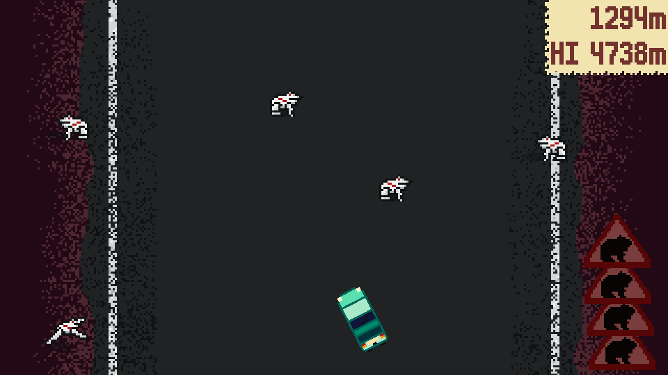

  
_Welcome to ribbit hell!_  
__Version__ `1.0.0-jam`  
__Godot Engine__ `4.0.3`  
__Copyright &copy; 2023 Chris Roberts__ (Krobbizoid).  
_All rights reserved._

# Contents
1. [Afrogalypse](#afrogalypse)
2. [Controls](#controls)
3. [Development](#development)
4. [Previous Jams](#previous-jams)
5. [Credits](#credits)
6. [License](#license)

# Afrogalypse
Afrogalypse is a bullet hell-esque score attack game where you are driving to
avoid an apocalypse of robotic frogs. You gain hit points when you pass road
signs, which can be exchanged for a boost and a brief period of invincibility.

You can download Afrogalypse or play it online at
[itch.io](https://krobbizoid.itch.io/afrogalypse) or the
[GitHub releases page](https://github.com/krobbi/afrogalypse/releases).

# Controls
The controls are currently fixed and require a keyboard.

| Input           | Action      |
| :-------------- | :---------- |
| A / Left Arrow  | Steer Left  |
| D / Right Arrow | Steer Right |
| Shift / X       | Brake       |
| Space / Z       | Boost       |

# Development
Afrogalypse was created as my first solo game jam project and an entry to the
[GMTK Game Jam 2023](https://itch.io/jam/gmtk-2023) - a 48-hour game jam hosted
by [Game Maker's Toolkit](https://www.youtube.com/@GMTK) with a secret theme
that is revealed when the jam starts.

The theme for 2023 was 'Roles Reversed'. My initial idea was a reverse horror
game where you play as a monster that can't move when seen and catch an
explorer. This idea was scrapped after several hours of development when it was
clear that it wouldn't be feasible to finish before the deadline and probably
wouldn't be very fun to play.

I decided to make a more arcade style game, which would be more enjoyable and
could be finished before the deadline. I settled on an inversion of Frogger
where you play as a car and have to avoid frogs.

Crashing into frogs felt a little cruel, so I replaced them with harmful
robotic frogs. This increased the sense of danger, and helped tie the game
together with an aesthetic.

# Previous Jams
I have participated in two GMTK game jams before with
[Ruxaroh](https://github.com/ruxaroh).

* 2022 - Roll of the Dice:
[The House Always Wins](https://github.com/krobbi/gmtk-2022).
* 2021 - Joined Together:
[Pandemonium](https://ruxaroh.itch.io/pandemonium).

# Credits
* Font: [m6x11](https://managore.itch.io/m6x11) by
[Daniel Linssen (Managore)](https://twitter.com/managore).
* Color palette: [Faraway48](https://lospec.com/palette-list/faraway48) by
[Igor Ferreira (Diemorth)](https://twitter.com/diemorth).

# License
Afrogalypse is released under the Krobbizoid Game License (KGL):  
https://krobbi.github.io/license/2023/kgl.txt

See [license.txt](license.txt) for a full copy of the license text.
